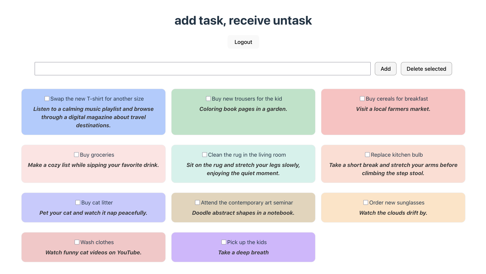

# UNTASK

## add task, receive untask

Fullstack application that allows users to enter pending tasks and receive in return an AI-generated excuse for not doing them. An experiment that mixes time management with humor and reflection on our daily life and priorities.

A public list of example tasks is displayed by default. To manage your own task list (add, check or delete tasks), login is required.

## 🛠️ Technologies Used

- **Frontend:** React

- **Backend:** Node.js, Express, Axios

- **Database:** PostgreSQL

- **Authentication:** JWT-based login system

- **IA**: OpenAI Api to generate non productive or leisure tasks


## 🎭 [Visit Untask](https://untask.vercel.app/)


## 🚀 How does it work?

How does it work?
- The user introduces a pending task
- The application stores the entry in the DB and sends a prompt to the AI.
- The AI returns a suggestion or non productive task.
- The frontend shows both tasks


## 🛠 Installation & Setup

1. Clone this repository:
   ```sh
   git clone https://github.com/azaharacc/untask-app.git
   cd untask-app
   ```
2. Backend Setup
   ```sh
   cd back
   npm install
   ```

   - Create a `.env` file in the back directory
   - Add your OpenAI API key and the Database URL:
     ```
     OPENAI_API_KEY=your_api_key_here
     DATABASE_TASKS=your_db_url
     JWT_SECRET=your_jwt_secret
     ```

4. Start the backend:
   ```sh
   node server.js
   ```
5. Frontend Setup
   ```sh
   cd front
   npm install
   npm run serve
   ```

## 🎉 To deploy this project

- Deploy your backend and set up the PostgreSQL database in production.

- Ensure your API endpoints are publicly accessible.

- Update frontend API URLs to point to the production backend.

- Deploy frontend on services like Netlify or Vercel.

- Remember to configure environment variables in production accordingly.

- Don't forget to set the environment variables correctly in production.
